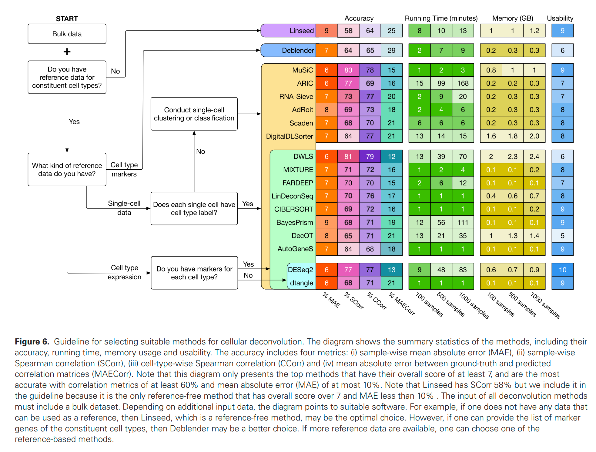

# 总论
根据文献 “Fourteen years of cellular deconvolution- methodology, applications, technical evaluation and outstanding challenges” 的综述，目前转录组数据解卷积细胞类型主要有三种方法

1. 有参：有相同组织的单细胞测序数据
1. 半参：有细胞marker
1. 无参：什么都没有，只有转录组测序数据


文献根据各种情况，提供了工具选择建议：




总体而言：
* 没有任何参考数据 → Linseed
* 有 marker gene 列表 → Deblender（semi-reference-free）
* 有带标注的单细胞数据 → MuSiC 或 DWLS（最推荐）
* 只有细胞类型表达矩阵 → DESeq2 unmix 或 dtangle


# 工具使用

## 无参 Linseed

>Linseed基本思路：      
>基础假设：同一细胞类型特异性表达的基因在不同的混合（bulk）样本中比表达量彼此呈严格的线性关系，这种互线性可用于无监督识别细胞类型特异性基因集。    
> geneA = k x geneB      


>基本流程：       
>先根据互线性构建网络，用奇异值分解的方式确定细胞类型数量K，在根据单纯形法估算细胞比例
>      

### 工具安装
1. 线上安装     
devtools::install_github("ctlab/linseed")

1. 线下安装      
git clone https://github.com/ctlab/LinSeed.git    
remotes::install_local("./LinSeed")


### 解卷积
```

# data 是归一化好的表达矩阵，基因-行；样本-列
# 创建Linseed对象
lo <- LinseedObject$new(data)
    
# evaluate all pairwise collinearity coefficients
lo$calculatePairwiseLinearity()
lo$calculateSpearmanCorrelation()
lo$calculateSignificanceLevel(100)
lo$significancePlot(0.01)

# 过滤掉不显著的
lo$filterDatasetByPval(0.01)

# 奇异值分解方差解释图
#lo$svdPlot()

lo$setCellTypeNumber(K)
lo$project("filtered") # projecting full dataset
lo$projectionPlot(color="filtered")

# 解卷积
lo$project("filtered")
lo$smartSearchCorners(dataset="filtered", error="norm")
lo$deconvolveByEndpoints()
#plotProportions(lo$proportions)

# lets select 100 genes closest to the simplex corners 
lo$selectGenes(100)


# 对象内容

lo$proportions   → 细胞比例矩阵
lo$signatures    → 各细胞类型基因表达特征
lo$markers       → 标志基因列表
lo$genes         → 过滤后用于分解的基因
lo$endpoints     → 单纯形顶点坐标
lo$cellTypeNumber → 当前 K 值（你是5）
```


## DualSimplex [Linseed的升级版]


# 先找最优K值 【无效，还是要看生物学解释程度，但是在统计上还是有意义的】
* 未完成，当前的结果是利用DualSimplex进行的

 ~/tools/R4.5.3/bin/Rscript Scripts/BestK.R --SampleFile samples.csv --Species Chicken --ReadsMatrix chicken.All.Reads.xls --OutPath Results


 